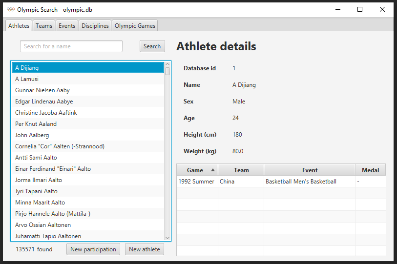
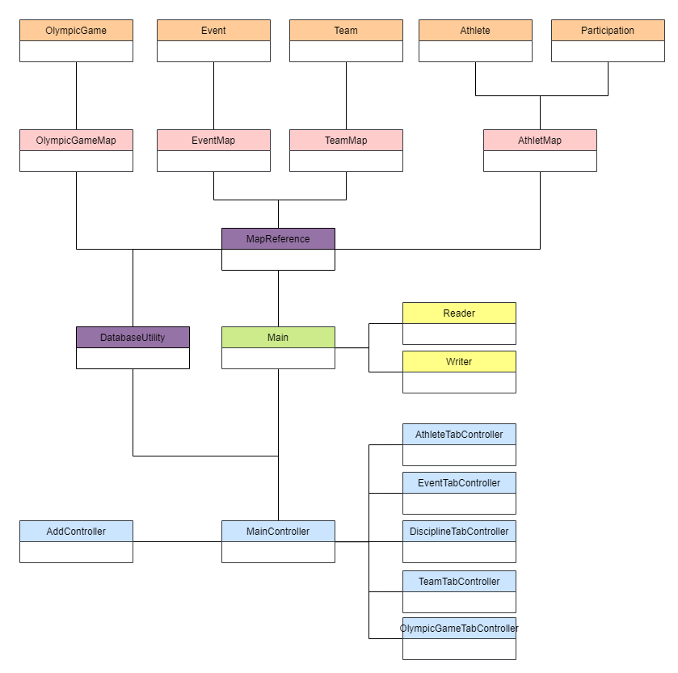
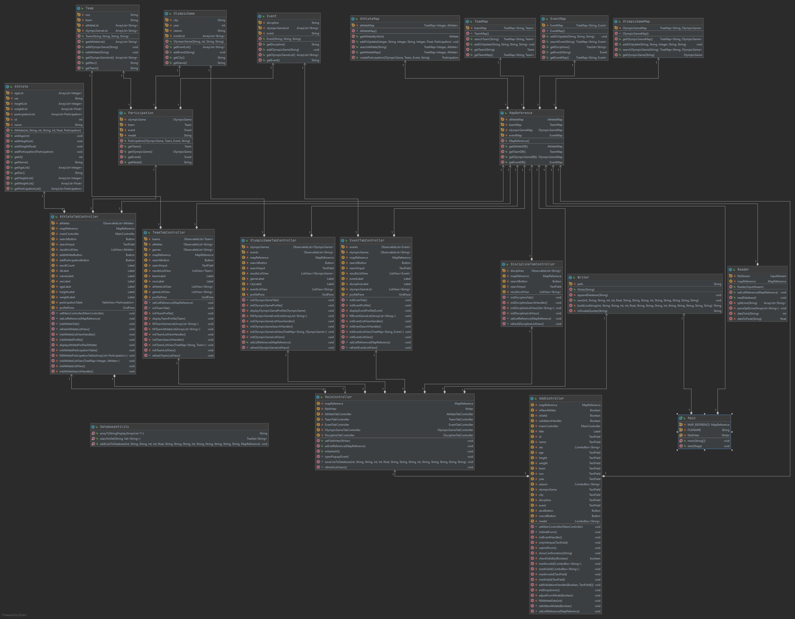

# OlympicSearch
Final assignment for the programming lecture.

The application allows users to browser a large dataset (ca. 135.000 athletes) or historic olympic athletes. The user can view details about each Athlete. 
Additionally, one can also browse teams, events, disciplines, and olympic games.

## Application
The application is written in Java and utlizies JavaFX.

## UML / Class structure

